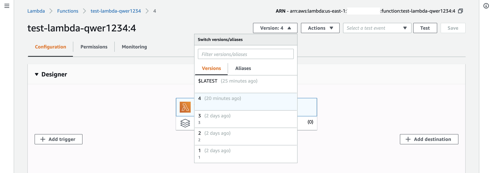

# Image Resize Lambda@Edge Function

본 코드는 AWS 의 Lambda@Edge 에서 동작하는 코드입니다.

### 기능
- 요청된 크기(width, height) 에 맞춰서 이미지 해상도를 조정.
    - query string 에서 각각 "w", "h" parameter 사용.
- 압축 quality 를 직접 지정 가능
    - query string 에서 "q" parameter 사용.
    - 1 - 95
    - 지정하지 않을 경우 기본값으로 75 사용.
- Resize 요청 시 JPEG 형식으로 자동 변환

### 사용하는 AWS Services
- S3 bucket
- CloudFront distribution
- Lambda Function

### Prerequisites (for deploy)
- AWS CLI
- Docker

### Lambda Function 생성 (AWS Web Console 기준)
- 반드시 ```us-east-1``` region 에서 생성해야 함.
- Runtime 은 Python 3.7 선택.
- Execution Role
    - Create a new role from AWS policy templates 선택.
    - Policy templates 에서 ```Basic Lambda@Edge permissions``` 선택.

### Lambda Function 으로 코드 업로드
아래의 command 를 순서대로 입력합니다.
- sudo 권한이 필요할 경우 sudo 를 붙여서 실행하면 됩니다.
- docker build 시 tag name 은 다른 거를 적으셔도 됩니다.
```bash
$ docker build --tag amazonlinux:python37 .
$ docker run --rm --volume $(pwd):/root amazonlinux:python37
$ cd package && zip -r9 ../function.zip .
$ cd .. && zip -g function.zip lambda_function.py
```

그리고 아래의 command 를 입력하여 업로드합니다.
- region 은 반드시 ```us-east-1``` 으로 지정.
- ```YOUR_LAMBDA_FUNCTION_NAME``` 에는 생성 시 입력한 이름을 입력.
```bash
$ aws lambda update-function-code \
--region us-east-1 \
--function-name <YOUR_LAMBDA_FUNCTION_NAME> \
--zip-file fileb://function.zip
```

### Publish Lambda Function
Lambda@Edge 에 deploy 를 위해서는 업로드한 코드의 Publish 가 선행되어야 합니다.  
아래 command 를 입력하여 publish 를 진행합니다.
```bash
$ aws lambda publish-version \
--region us-east-1 \
--function-name <YOUR_LAMBDA_FUNCTION_NAME>
```

### Deploy to Lambda@Edge
CLI 로 다루기 약간 복잡해서 Web Console 로 하는 법을 첨부합니다.


대상의 버전을 선택한 후 Add Trigger 를 눌러줍니다.


- CloudFront 선택.
- Distribution: Lambda@Edge 를 적용할 distribution 의 ID 선택.
- CloudFront Event 는 Origin Response 선택.

그리고 Add 를 눌러줍니다.

### S3 Bucket Policy 수정
S3 Bucket 정책을 열면 아마 ```Sid 1``` 에 해당하는 부분만 존재할 것입니다.
```json
{
    "Version": "2008-10-17",
    "Id": "PolicyForCloudFrontPrivateContent",
    "Statement": [
        {
            "Sid": "1",
            "Effect": "Allow",
            "Principal": {
                "AWS": "arn:aws:iam::cloudfront:user/CloudFront Origin Access Identity XXXXXXXXXXXXX"
            },
            "Action": "s3:GetObject",
            "Resource": "arn:aws:s3:::YOUR_S3_BUCKET/*"
        },
        {
            "Sid": "2",
            "Effect": "Allow",
            "Principal": {
                "AWS": "arn:aws:iam::XXXXXXXXXXXX:role/service-role/YOUR_ROLE_ASSOCIATED_WITH_LAMBDA_FUNCTION"
            },
            "Action": "s3:GetObject",
            "Resource": "arn:aws:s3:::YOUR_S3_BUCKET/*"
        },
        {
            "Sid": "3",
            "Effect": "Allow",
            "Principal": {
                "AWS": "arn:aws:iam::XXXXXXXXXXXX:role/service-role/YOUR_ROLE_ASSOCIATED_WITH_LAMBDA_FUNCTION"
            },
            "Action": "s3:PutObject",
            "Resource": "arn:aws:s3:::YOUR_S3_BUCKET/*"
        }
    ]
}
```
```Sid 2```, ```Sid 3``` 에 해당하는 부분을 추가해주도록 합니다.

여기까지 하면 아마 정상적으로 적용이 될 것입니다.